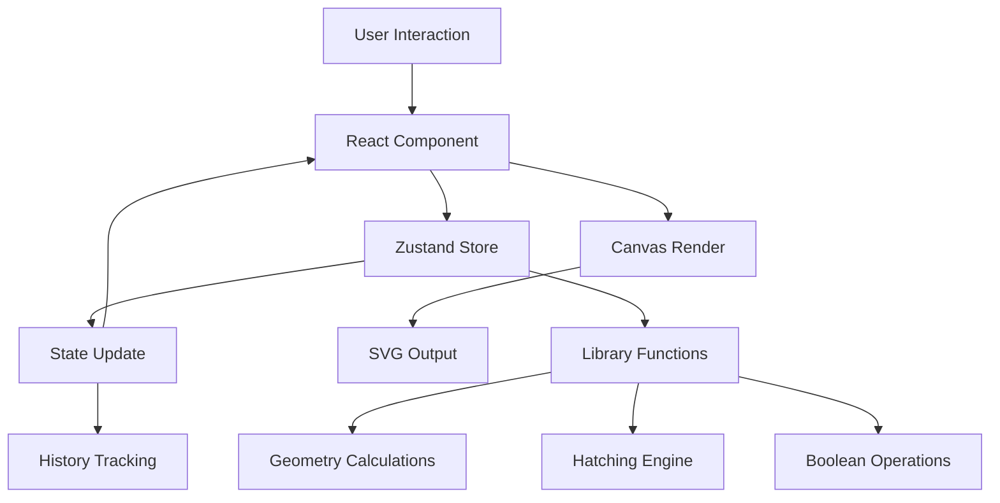

# Architecture Documentation

## Overview

HatchStudio is a professional vector design tool built with React, TypeScript, and modern web technologies. The architecture is designed for precision, performance, and extensibility, with a focus on pen plotter optimization.

## Technology Stack

### Core Framework
- **React 18.2** - UI framework with hooks and functional components
- **TypeScript 5.2** - Type-safe development
- **Vite 5.0** - Fast build tool and dev server

### State Management
- **Zustand 4.4** - Lightweight state management
  - Single store pattern (`useAppStore`)
  - Immutable updates with history tracking
  - Async actions for save/load operations

### Styling
- **Tailwind CSS 3.4** - Utility-first CSS framework
- **Monochrome technical theme** - Professional design aesthetic
- **Responsive layout** - Fixed panel widths with flexible canvas

### Geometry & Graphics
- **Paper.js 0.12** - Boolean operations and path manipulation
- **SVG rendering** - Native browser SVG for all graphics
- **Custom geometry library** - Millimeter-based calculations

### Icons & UI
- **Lucide React 0.344** - Icon library
- **Custom design system** - Reusable UI components

## System Architecture

### Component Hierarchy

```
App
├── ErrorBoundary
├── TopBar
│   ├── Tool Selection
│   ├── Alignment Tools
│   ├── Undo/Redo
│   └── Export Button
├── LeftPanel
│   ├── Layers Tab
│   │   └── LayersTab (drag-drop, visibility, locking)
│   └── Projects Tab
│       └── Save/Load Projects
├── Canvas
│   ├── SVG Viewport
│   ├── Shape Rendering
│   ├── Selection Overlay
│   └── Snap Guides
└── RightPanel
    ├── Properties Panel (when selected)
    └── Canvas Settings (when no selection)
```

### Data Flow



## State Management

### Store Structure

The Zustand store (`src/store/index.ts`) manages all application state:

```typescript
interface AppState extends ProjectState {
  // Paper settings
  paper: PaperSettings;
  
  // Shapes and selection
  shapes: Shape[];
  selectedShapeIds: string[];
  
  // View and tool state
  viewTransform: ViewTransform;
  tool: ToolType;
  
  // Hatching parameters (per shape)
  hatchParams: Record<string, HatchParams>;
  
  // Snapping configuration
  snapping: SnappingConfig;
  
  // History (undo/redo)
  history: {
    past: StateSnapshot[];
    present: StateSnapshot;
    future: StateSnapshot[];
  };
  
  // Project management
  savedProjects: SavedProject[];
  
  // UI state
  eyedropperMode: EyedropperMode;
  swatches: string[];
}
```

### State Snapshots

State snapshots capture the complete application state for:
- **Undo/Redo** - Full history tracking
- **Project Save/Load** - Persistent storage
- **State comparison** - Change detection

Snapshots exclude:
- `selectedShapeIds` (selection is preserved during undo/redo)
- UI-only state (eyedropper mode, swatches)

### History Management

The history system uses a three-stack approach:
- **Past** - Previous states (undo)
- **Present** - Current state
- **Future** - Redone states

State changes are batched:
- Drag operations commit on mouse up
- Property changes commit immediately
- Selection changes don't create history entries

## Coordinate System

### Millimeter-Based System

**Critical:** All coordinates, dimensions, and calculations use millimeters.

- **1 SVG User Unit = 1 Millimeter**
- **No pixel conversion** - Direct mm to SVG mapping
- **Export includes explicit units:** `width="210mm" height="297mm"`

### Coordinate Transformations

The system handles three coordinate spaces:

1. **World Space (mm)** - Absolute coordinates on the paper
2. **Screen Space (px)** - Browser viewport pixels
3. **Shape Space (mm)** - Local coordinates relative to shape center

Transformations are handled in `src/lib/coords.ts`:
- `screenToWorld()` - Convert mouse position to mm coordinates
- `calculateViewBoxDimensions()` - Compute SVG viewBox from viewport

### View Transform

The view transform tracks the camera position:
```typescript
interface ViewTransform {
  centerX: number;  // World X center (mm)
  centerY: number;  // World Y center (mm)
  scale: number;    // Zoom level (1.0 = 100%)
}
```

Zoom range: 0.1x (10%) to 20.0x (2000%)

## File Structure

```
src/
├── main.tsx              # Entry point
├── App.tsx               # Root component
├── index.css             # Global styles
│
├── components/           # React components
│   ├── App.tsx           # Main app layout
│   ├── Canvas.tsx        # SVG canvas and interaction
│   ├── TopBar.tsx        # Toolbar and actions
│   ├── LeftPanel.tsx     # Layers and projects
│   ├── RightPanel.tsx    # Properties and settings
│   ├── SelectionOverlay.tsx  # Transform handles
│   ├── ColorPanel.tsx    # Color picker
│   ├── PathfinderPanel.tsx   # Boolean operations
│   ├── ErrorBoundary.tsx     # Error handling
│   │
│   ├── sidebar/          # Sidebar tabs
│   │   └── LayersTab.tsx
│   │
│   └── ui/               # Design system
│       └── DesignSystem.tsx
│
├── store/                # State management
│   └── index.ts          # Zustand store
│
├── lib/                  # Core libraries
│   ├── geometry.ts       # Shape calculations
│   ├── hatching.ts       # Hatching engine
│   ├── boolean.ts        # Boolean operations
│   ├── coords.ts         # Coordinate transforms
│   ├── snapping.ts       # Snap detection
│   ├── svg-export.ts    # SVG generation
│   └── thumbnail.ts      # Thumbnail generation
│
├── types/                # TypeScript definitions
│   └── index.ts          # All type definitions
│
└── hooks/                # Custom hooks
    ├── index.ts
    └── useKeyboardShortcuts.ts
```

## Component Patterns

### Controlled Components

All form inputs are controlled by Zustand state:
```typescript
const value = useAppStore(state => state.paper.width);
const setValue = useAppStore(state => state.setPaperSize);
```

### Event Handling

Canvas interactions use refs and callbacks:
- Mouse events captured on SVG element
- World coordinates calculated from screen position
- State updates batched for performance

### Rendering Optimization

- **SVG rendering** - Direct DOM manipulation for shapes
- **Conditional rendering** - Components only render when needed
- **Memoization** - Expensive calculations cached

## Extension Points

### Adding New Shape Types

1. Add type to `Shape` union in `types/index.ts`
2. Implement shape interface extending `BaseShape`
3. Add vertex calculation in `lib/geometry.ts`
4. Add rendering in `Canvas.tsx`
5. Add properties panel in `RightPanel.tsx`

### Adding New Tools

1. Add tool type to `ToolType`
2. Implement tool logic in `Canvas.tsx`
3. Add tool button in `TopBar.tsx`
4. Add keyboard shortcut in `useKeyboardShortcuts.ts`

### Custom Hatching Algorithms

1. Extend `HatchParams` interface
2. Implement algorithm in `lib/hatching.ts`
3. Add UI controls in `RightPanel.tsx` or `HatchTab.tsx`

## Performance Considerations

### Optimization Strategies

1. **State Updates**
   - Batch updates during drag operations
   - Use `pushState()` only when state actually changes
   - Avoid unnecessary re-renders with selective subscriptions

2. **Rendering**
   - SVG elements reused when possible
   - Expensive calculations memoized
   - Canvas only re-renders on state changes

3. **History**
   - Snapshots use JSON serialization (fast for small projects)
   - History limited to prevent memory issues
   - Selection excluded from snapshots

4. **Geometry**
   - Calculations use efficient algorithms
   - Bounding boxes cached
   - Point-in-shape tests optimized

## Related Documentation

- [API_REFERENCE.md](./API_REFERENCE.md) - Store API and function reference
- [GEOMETRY_SYSTEM.md](./GEOMETRY_SYSTEM.md) - Coordinate system details
- [EXTENDING_HATCHSTUDIO.md](./EXTENDING_HATCHSTUDIO.md) - Extension guide
- [TROUBLESHOOTING.md](./TROUBLESHOOTING.md) - Performance and debugging

