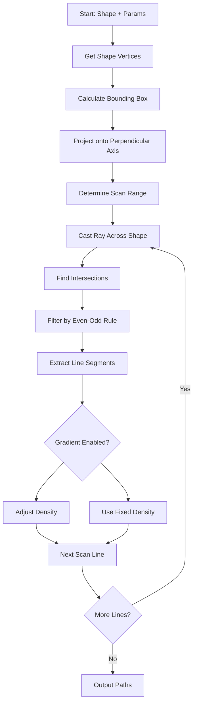

# Hatching Engine Documentation

## Overview

The hatching engine converts vector shapes into plotter-friendly line paths. It uses raycasting algorithms to generate parallel lines that fill shapes while respecting holes and complex geometries.

## Core Algorithm

### Raycasting Method

The hatching engine uses a **raycasting scan** approach:

1. **Calculate Bounding Box** - Determine shape extent
2. **Project onto Perpendicular Axis** - Find scan range
3. **Cast Rays** - Intersect rays with shape contours
4. **Extract Segments** - Connect enter/exit points
5. **Handle Holes** - Use even-odd rule for compound paths

### Algorithm Flow



## Parameters

### Basic Parameters

#### `enabled: boolean`
Toggle hatching on/off. When disabled, only outline is rendered (if enabled).

#### `density: number` (0.5-20mm)
Distance between parallel lines. Lower values = denser hatching.

**Example:**
- `density: 1` - Very dense (1mm spacing)
- `density: 5` - Sparse (5mm spacing)
- `density: 10` - Very sparse (10mm spacing)

#### `angle: number` (0-180°)
Direction of hatch lines. 0° = horizontal, 90° = vertical.

**Snap Points:** 45°, 90°, 180°

**Example:**
```typescript
angle: 45   // Diagonal lines (top-left to bottom-right)
angle: 90   // Vertical lines
angle: 0    // Horizontal lines
```

#### `offset: number` (0-50mm)
Shifts the starting position of lines. Useful for aligning hatches between shapes.

**Use Case:**
- Align hatches across multiple shapes
- Create phase-shifted patterns
- Match existing designs

### Space Modes

#### `spaceMode: 'local' | 'world'`

**Local Mode (Default):**
- Lines rotate with the shape
- Angle 0° = always horizontal relative to shape
- Hatching follows shape orientation
- **Use Case:** Hatching that rotates with shape

**World Mode:**
- Lines stay fixed to canvas
- Angle 0° = always horizontal on screen
- Acts like a "mask" over shapes
- **Use Case:** Consistent hatching across rotated shapes

**Example:**
```
Shape rotated 45°:
- Local mode: Hatch lines also rotated 45°
- World mode: Hatch lines stay horizontal
```

### Outline Rendering

#### `renderOutline: boolean`
Toggle to show/hide original shape outline when hatching is enabled.

- **Lines always show outline** (regardless of setting)
- Useful for preview vs. export
- Disabled by default for boolean results

## Advanced Features

### Cross-Hatching

#### `crossHatchEnabled: boolean`
Adds a second pass of lines perpendicular to the first.

#### `crossHatchPerpendicular: boolean`
When true, second pass is automatically 90° to first pass.

#### `crossHatchAngle: number` (0-180°)
Custom angle for second pass (when not perpendicular).

**Example:**
```typescript
{
  angle: 45,
  crossHatchEnabled: true,
  crossHatchPerpendicular: true
  // Results in 45° and 135° lines
}
```

**Use Cases:**
- Dense fill patterns
- Texture effects
- Shading

### Zig-Zag Connection

#### `zigZagEnabled: boolean`
Connects line ends to form one continuous path.

**Benefits:**
- Reduces plot time (fewer pen-up movements)
- Single path instead of multiple segments
- Optimized for pen plotters

**Algorithm:**
1. Generate all line segments
2. Connect segments end-to-end
3. Choose closest endpoint for each connection
4. Output single continuous path

**Example:**
```
Without zig-zag:
M 10,10 L 50,10
M 10,20 L 50,20
M 10,30 L 50,30

With zig-zag:
M 10,10 L 50,10 L 50,20 L 10,20 L 10,30 L 50,30
```

### Gradient Hatching

#### `gradientEnabled: boolean`
Varies density across the shape.

#### `gradientStart: number` (0.1-10mm)
Density at the start of the gradient.

#### `gradientEnd: number` (0.1-10mm)
Density at the end of the gradient.

#### `gradientAngle: number` (0-360°)
Direction of the gradient.

**Algorithm:**
1. Project all shape points onto gradient direction
2. Calculate progress (0 to 1) along gradient
3. Interpolate density: `density = start + (end - start) * progress`

**Example:**
```typescript
{
  gradientEnabled: true,
  gradientStart: 1,      // Dense at start
  gradientEnd: 10,       // Sparse at end
  gradientAngle: 90      // Vertical gradient
}
```

**Use Cases:**
- Shading effects
- Depth perception
- Artistic effects

## Hole Handling

### Compound Paths

Shapes with holes (from boolean operations) are handled using the **even-odd fill rule**.

**Algorithm:**
1. Collect all contours (main outline + holes)
2. Cast ray through all contours
3. Count intersections
4. Even intersections = outside, Odd = inside

**Example:**
```
Donut shape:
- Main circle (outline)
- Inner circle (hole)
- Ray enters outline (1) → inside
- Ray enters hole (2) → outside
- Ray exits hole (3) → inside
- Ray exits outline (4) → outside
```

### Rounded Corners

When shapes have `cornerRadius`, the hatching must match the rounded outline exactly.

**Critical Implementation:**
- Uses same arc center calculation as SVG outline
- Perpendicular bisector method for arc centers
- Handles both convex and concave corners
- Winding order detection (clockwise vs. counterclockwise)

**Files:**
- `src/lib/geometry.ts` - `generateRoundedPolylinePoints()`
- Uses adaptive sampling (8-32 points per corner)

## Implementation Details

### Raycasting Algorithm

```typescript
// 1. Calculate scan direction
const angle = params.spaceMode === 'local' 
  ? params.angle + shape.rotation 
  : params.angle;
const rad = (angle * Math.PI) / 180;
const dirX = Math.cos(rad);  // Line direction
const dirY = Math.sin(rad);
const perpX = -Math.sin(rad); // Scan direction
const perpY = Math.cos(rad);

// 2. Project shape onto perpendicular axis
let minP = Infinity, maxP = -Infinity;
outline.forEach(p => {
  const val = p.x * perpX + p.y * perpY;
  minP = Math.min(minP, val);
  maxP = Math.max(maxP, val);
});

// 3. Scan along perpendicular axis
let currentPos = minP + params.offset;
while (currentPos <= maxP) {
  // Cast ray across shape
  const origin = calculateOrigin(currentPos);
  const hits = intersectRayWithContours(origin, dirX, dirY);
  
  // Connect pairs (enter, exit)
  for (let i = 0; i < hits.length - 1; i += 2) {
    segments.push({ start: hits[i], end: hits[i+1] });
  }
  
  // Increment position
  const step = calculateStep(currentPos, gradient);
  currentPos += step;
}
```

### Intersection Calculation

Uses line segment intersection algorithm:

```typescript
function intersect(p1, p2, p3, p4): Point | null {
  const det = (p2.x - p1.x) * (p4.y - p3.y) - 
              (p4.x - p3.x) * (p2.y - p1.y);
  if (det === 0) return null; // Parallel
  
  const lambda = /* ... */;
  const gamma = /* ... */;
  
  if (0 <= lambda && lambda <= 1 && 
      0 <= gamma && gamma <= 1) {
    return intersection point;
  }
  return null;
}
```

### Gradient Density Calculation

```typescript
if (params.gradientEnabled) {
  // Project scan line origin onto gradient direction
  const gradientProj = origin.x * gradientDirX + 
                        origin.y * gradientDirY;
  
  // Calculate progress (0 to 1)
  const progress = (gradientProj - gradientMinProj) / 
                   (gradientMaxProj - gradientMinProj);
  const cleanProgress = Math.max(0, Math.min(1, progress));
  
  // Interpolate density
  step = params.gradientStart + 
         (params.gradientEnd - params.gradientStart) * 
         cleanProgress;
}
```

## Performance Considerations

### Optimization Strategies

1. **Bounding Box Culling**
   - Skip shapes outside viewport
   - Early exit for empty shapes

2. **Segment Filtering**
   - Remove tiny segments (< 0.1mm)
   - Prevents unnecessary paths

3. **Adaptive Sampling**
   - More samples for sharp corners
   - Fewer samples for straight segments

4. **Caching**
   - Cache vertex calculations
   - Reuse bounding boxes

### Complexity

- **Time:** O(n × m) where n = scan lines, m = contour edges
- **Space:** O(s) where s = number of segments

For typical shapes:
- 100 scan lines × 10 edges = 1000 intersections
- Very fast for modern browsers

## Edge Cases

### Degenerate Shapes

- **Zero area shapes** - Return empty
- **Single point** - Return empty
- **Collinear points** - Handled gracefully

### Extreme Angles

- **0° or 180°** - Horizontal lines
- **90°** - Vertical lines
- **Near 0°** - Very dense lines (may be slow)

### Very Small Shapes

- **Sub-millimeter shapes** - May produce no lines
- **Density > shape size** - Single line or empty

### Complex Geometries

- **Self-intersecting shapes** - Even-odd rule handles correctly
- **Multiple holes** - All holes respected
- **Nested groups** - Handled recursively

## Examples

### Basic Hatching

```typescript
const params: HatchParams = {
  enabled: true,
  density: 2,
  angle: 45,
  offset: 0,
  spaceMode: 'local',
  renderOutline: false
};
```

### Cross-Hatch Pattern

```typescript
const params: HatchParams = {
  enabled: true,
  density: 3,
  angle: 0,
  crossHatchEnabled: true,
  crossHatchPerpendicular: true,
  zigZagEnabled: true
};
```

### Gradient Shading

```typescript
const params: HatchParams = {
  enabled: true,
  density: 2,
  angle: 90,
  gradientEnabled: true,
  gradientStart: 1,
  gradientEnd: 8,
  gradientAngle: 0  // Horizontal gradient
};
```

## Related Documentation

- [FEATURES.md](./FEATURES.md) - User-facing feature documentation
- [GEOMETRY_SYSTEM.md](./GEOMETRY_SYSTEM.md) - Geometry calculations
- [API_REFERENCE.md](./API_REFERENCE.md) - API details
- [BOOLEAN_OPERATIONS.md](./BOOLEAN_OPERATIONS.md) - Hole creation

